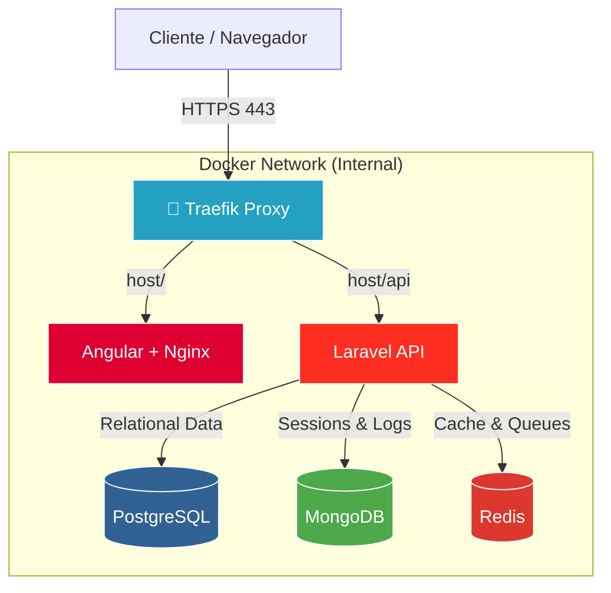

# Send.IO

<div align="center">

<br>

**Send.IO** es una aplicación una arquitectura de microservicios contenerizada. Está construida pensando en la esalabilidad usando **Laravel** como base para la **API** en el backend y **Angular** en el frontend.

<br>


</div>

---

## Arquitectura del Sistema

El siguiente diagrama ilustra cómo fluye el tráfico desde el usuario hasta nuestros servicios y cómo interactúan los componentes de datos en producción.



---

## Tech Stack en Detalle

### Backend & Core

* **Laravel 11:** Actúa como API RESTful pura. No renderiza vistas, solo devuelve JSON estandarizado.
* **PHP 8.4:** Aprovechamos las últimas características de JIT y tipado fuerte.
* **Arquitectura Hexagonal (Concepto):** Servicios desacoplados listos para ser extraídos a microservicios independientes si la carga lo requiere.

### Frontend

* **Angular (Latest):** Aplicación SPA (Single Page Application).
* **Optimización:** Compilado con AOT (Ahead-of-Time) y servido mediante Nginx Alpine para un peso mínimo y máxima velocidad de carga.

### Bases de Datos (Estrategia Híbrida)

Utilizamos el motor adecuado para cada tipo de dato, maximizando el rendimiento:

1. **PostgreSQL (ACID):** La fuente de la verdad. Almacena usuarios, transacciones y datos relacionales críticos.
2. **MongoDB (Document Store):** Manejo de **Sesiones** y logs masivos. Esto evita bloqueos de escritura en la base de datos principal (Postgres) cuando hay miles de usuarios concurrentes.
3. **Redis (In-Memory):** Caché de consultas, *rate limiting* y gestión de colas de trabajos asíncronos (Jobs).

---

## Instalación y Entorno de Desarrollo

Hemos diseñado un flujo de trabajo **Híbrido (Docker + Nativo)**. Esto permite tener la robustez de los contenedores en el backend, pero la velocidad de compilación instantánea (Hot Reload) en el frontend.

### Requisitos Previos

* [Docker Desktop](https://www.docker.com/products/docker-desktop/)
* [Node.js](https://nodejs.org/) (v18+)
* [Git](https://git-scm.com/)

### Paso 1: Backend (Dockerizado)

El backend y las bases de datos corren aislados en contenedores para garantizar que tu entorno sea idéntico a producción.

```bash
# 1. Clonar el repositorio
git clone https://github.com/Chopyh/Send.IO.git
cd Send.IO

# 2. Configurar entorno
cp backend/.env.example backend/.env
# NOTA: Asegúrate de usar los hosts de docker: DB_HOST=postgres, REDIS_HOST=redis

# 3. Levantar infraestructura
docker compose up -d

# 4. Inicializar API (Solo la primera vez)
docker compose exec api composer install
docker compose exec api php artisan key:generate
docker compose exec api php artisan migrate

```

> La API estará disponible en: `http://localhost:8000`

### Paso 2: Frontend (Local)

Ejecutamos Angular fuera de Docker para aprovechar la velocidad de tu CPU local.

**Elige tu package manager favorito:**

#### npm (Predeterminado)


```bash
cd frontend
npm install
npm start
```

#### pnpm (Recomendado - Más rápido)


```bash
cd frontend
pnpm install
pnpm start
```

#### Bun (Ultra rápido)


```bash
cd frontend
bun install
bun start
```

#### Yarn


```bash
cd frontend
yarn install
yarn start
```

#### Deno (Con importmap)


```bash
cd frontend
deno task install
deno task start
```

> La Web App estará disponible en: `http://localhost:4200`

---

## Conectividad y Puertos

Gracias al archivo `docker-compose.override.yml` incluido, el entorno de desarrollo expone los puertos necesarios para herramientas de gestión (TablePlus, Compass, Postman), mientras que en producción estos permanecen cerrados por seguridad.

| Servicio        | Puerto Host | Uso                               |
| --------------- | ----------- | --------------------------------- |
| **API Backend** | `8000`      | Endpoints REST (`/api/...`)       |
| **Frontend**    | `4200`      | Interfaz de Usuario (Angular CLI) |
| **PostgreSQL**  | `5432`      | Conexión SQL Directa              |
| **MongoDB**     | `27017`     | Inspección de Sesiones            |
| **Redis**       | `6379`      | Monitorización de Caché           |

---

## Infraestructura de Producción (DevOps)

El despliegue está automatizado mediante **Coolify** y sigue principios de **Infraestructura Inmutable**.

### Despliegue en Coolify

Dado que el servicio de **frontend** está configurado con un perfil de Docker para no interferir en desarrollo local, es necesario activarlo explícitamente en producción.

1. En tu panel de Coolify, ve a la configuración de tu servicio/proyecto.
2. Navega a **Environment Variables**.
3. Añade la siguiente variable para activar el contenedor de producción del frontend:
   
   ```env
   COMPOSE_PROFILES=production
   ```

### Pipeline de Construcción (CI/CD)

1. **Git Push:** Al recibir cambios en la rama `main`.
2. **Multi-Stage Build:** Docker construye las imágenes en etapas para reducir el tamaño final:
* *Frontend:* Usa una imagen Node para compilar y luego copia los archivos estáticos (`dist/`) a una imagen Nginx Alpine limpia (peso < 20MB).
* *Backend:* Instala dependencias con `--no-dev`, optimiza el autoloader y elimina archivos innecesarios.


3. **Healthchecks:** Traefik no enruta tráfico hasta que los contenedores reportan estar "Healthy" (Base de datos conectada y API respondiendo).

### Routing Inteligente (Traefik)

Traefik actúa como Edge Router, gestionando automáticamente los certificados SSL (Let's Encrypt) y el balanceo de carga:

* Dominio raíz (`sendio.chopy.me`) ➔ Contenedor Frontend.
* Prefijo `/api` (`sendio.chopy.me/api`) ➔ Contenedor Backend (Prioridad Alta).

---

## Seguridad

* **Network Isolation:** En producción, las bases de datos no exponen puertos al exterior. Solo la API puede hablar con ellas a través de la red interna `red_interna`.
* **Proxy Reverso:** Nginx y Traefik ocultan la infraestructura subyacente y cabeceras de servidor.
* **Sanitización:** Laravel protege contra inyección SQL y XSS por defecto.